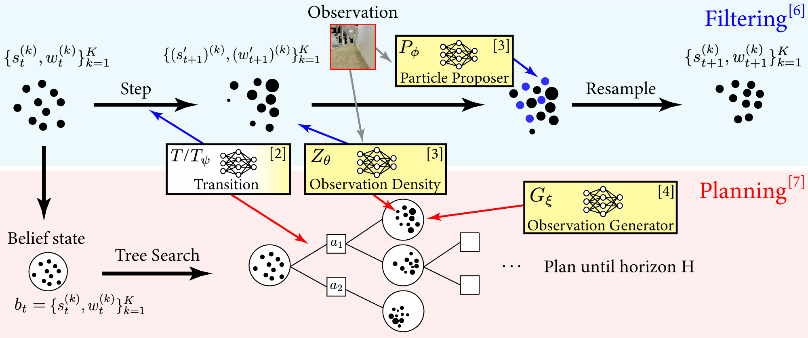

# Compositional Learning-based Planning for Vision POMDPs
This is the codebase for Compositional Learning-based Planning for Vision POMDPs [[Deglurkar, Lim, et al.]](https://arxiv.org/abs/2112.09456). It is adapted from the [codebase](https://github.com/Cranial-XIX/DualSMC) for the [DualSMC](https://www.ijcai.org/Proceedings/2020/0579.pdf) baseline method.

## Visual Tree Search


### Summary of VTS
The Partially Observable Markov Decision Process (POMDP) is a powerful framework for capturing decision-making problems that involve state and transition uncertainty. However, most current POMDP planners cannot effectively handle high-dimensional image observations prevalent in real world applications, and often require lengthy online training that requires interaction with the environment. The Visual Tree Search (VTS) algorithm is a compositional learning and planning procedure that combines generative models learned offline with online model-based POMDP planning. The deep generative observation models evaluate the likelihood of and predict future image observations in a Monte Carlo tree search planner. VTS is robust to different types of image noises that were not present during training and can adapt to different reward structures without the need to re-train. It outperforms several baseline state-of-the-art vision POMDP algorithms while using a fraction of the training time.

# Setup
The setup and requirements for the project conda environment is similar to that in this HuMAnav-Release [codebase](https://github.com/vtolani95/HumANav-Release). The codebase also provides instructions for how to download the Stanford Large Scale 3D Indoor Spaces Dataset, which is necessary to run our 3D Light-Dark experiments but not our Floor Positioning experiments. You may skip the "Download SMPL data & Render human meshes" section. Otherwise, follow all instructions on the HumANav-Release README. You may also change the name of the desired conda environment by modifying the "name" field of the HumANav-Release codebase's `environment.yml` file. 

Inside the newly created conda environment, additionally run

```
conda install pytorch==1.4.0 torchvision==0.5.0 cudatoolkit=9.2 -c pytorch
pip install scikit-learn
```

Copy the file `misc/examples.py` in this codebase into the HumANav-Release codebase's file `examples/examples.py`. At the top of the file, change the field `HUMANAV_PATH` to your absolute path to the HumANav-Release codebase. For the 3D Light-Dark experiment, the `examples.py` file can also be run in the command line to generate the pre-training dataset. Change the field `DATA_PATH` at the top of the file to point to the desired location for the dataset. 

Finally, within this codebase change the line `self.training_data_path = ...` inside `configs/environments/stanford.py` to point to the location of the training data. Additionally, within `configs/solver/observation_generation.py` change the line `self.save_path` to indicate where the observation conditional generator network should be saved after pretraining. 

Whenever subsequently running the code in this codebase, make sure to first run the following inside the conda environment:

```
export PYTHONPATH=$PYTHONPATH:/PATH/TO/VisualTreeSearch
export PYTHONPATH=$PYTHONPATH:/PATH/TO/HumANavRelease
export PYOPENGL_PLATFORM=egl
``` 

# Running Experiments

## Floor Positioning 
Our method involves a pretraining stage in which all neural network modules are learned offline, followed by an online testing stage. To only perform pretraining, run

```
python scripts/run_vts.py --pretrain
```

Or to only perform testing, run

```
python scripts/run_vts.py --test path/to/saved/models
```

Both pretraining and testing can be performed in sequence via

```
python scripts/run_vts.py --pretrain-test
```

The DualSMC baseline can additionally be run using

```
python scripts/run_dualsmc.py 
```

for both training and testing and with similar flags for just training or just testing; see the `run_dualsmc.py` file for more details.


## 3D Light-Dark
As mentioned above, first generate the training dataset by running the `examples.py` file in the command line. 

To only perform pretraining, run

```
python scripts/run_vts_lightdark.py --pretrain
```

Or to only perform testing, run

```
python scripts/run_vts_lightdark.py --test path/to/saved/models
```

Both pretraining and testing can be performed in sequence via

```
python scripts/run_vts_lightdark.py --pretrain-test
```

The test traps and occlusions experiments mentioned in the paper can also be run via

```
python scripts/run_vts_lightdark.py --test-traps path/to/saved/models
python scripts/run_vts_lightdark.py --occlusions path/to/saved/models
```

The DualSMC baseline can additionally be run with similar arguments as above:

```
python scripts/run_dualsmc_lightdark.py 
```

See the `run_vts_lightdark.py` and `run_dualsmc_lightdark.py` files for more details on command line options.


During the above, you may see command line outputs like this, which is normal:
```
ERROR:root:Loading building from obj file: /home/sampada/LB_WayPtNav_Data/stanford_building_parser_dataset/mesh/area5a/42795abd0bf841a098ea084d326f95af.obj
ERROR:root:#Meshes: 160
WARNING:OpenGL.arrays.numpymodule:Unable to load numpy_formathandler accelerator from OpenGL_accelerate
/home/sampada/HumANavRelease/humanav/humanav_renderer.py:223: RuntimeWarning: divide by zero encountered in true_divide
  depth_imgs_meters = 100. / disparity_imgs_cm[..., 0]
```